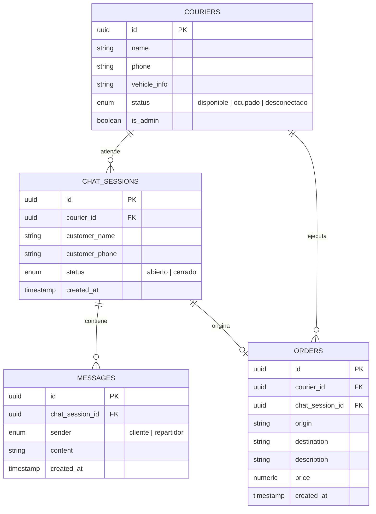

# 🏗️ Arquitectura y Diseño del Sistema - Golden Express

Este documento proporciona una visión técnica detallada sobre la arquitectura de software, el diseño de datos, los patrones de comunicación en tiempo real y el sistema visual de **Golden Express**, una aplicación web full-stack de delivery express y mensajería en tiempo real.

---

## 📋 Tabla de Contenidos
1. [Resumen Ejecutivo](#1-resumen-ejecutivo)
2. [Stack Tecnológico Core](#2-stack-tecnológico-core)
3. [Estructura del Proyecto](#3-estructura-del-proyecto)
4. [Modelo de Base de Datos (Schema)](#4-modelo-de-base-de-datos-schema)
5. [Patrones de Arquitectura y Comunicación](#5-patrones-de-arquitectura-y-comunicación)
6. [Flujos de Datos Principales](#6-flujos-de-datos-principales)
7. [Seguridad y Autenticación](#7-seguridad-y-autenticación)
8. [Sistema de Diseño Visual](#8-sistema-de-diseño-visual)

---

## 🚀 1. Resumen Ejecutivo

**Golden Express** está diseñado para conectar clientes con repartidores locales de manera inmediata y fluida. Los clientes pueden visualizar la flota de repartidores en tiempo real, conocer su disponibilidad y tipo de vehículo, y coordinar servicios a través de un chat en vivo sin necesidad de registro previo. Los repartidores cuentan con un panel de control donde gestionan su disponibilidad, atienden clientes, registran pedidos oficialmente y consultan su historial de envíos. Los administradores disponen de herramientas para invitar, gestionar y dar de baja al personal.

---

## 🛠️ 2. Stack Tecnológico Core

* **Framework Full-Stack:** [Next.js 15+ (App Router)](https://nextjs.org/)
* **Librería UI:** [React 19](https://react.dev/)
* **Lenguaje:** [TypeScript](https://www.typescriptlang.org/)
* **Plataforma Backend & BaaS:** [Supabase](https://supabase.com/)
  * **Database:** PostgreSQL
  * **Auth:** Supabase Auth (SSR Cookie-based Authentication)
  * **Realtime:** Engine basado en WebSockets (`postgres_changes`)
* **Estilos & Diseño:** Tailwind CSS (Vanilla CSS Custom Utilities) + Lucide Icons
* **Middleware & Router Handler:** `@supabase/ssr` en `proxy.ts`
* **Email System:** React Email / Plantillas integradas (`emails/ResetPasswordEmail.tsx`)

---

## 📁 3. Estructura del Proyecto

```text
golden-express/
├── app/
│   ├── (public)/                 # Zona pública (Cliente)
│   │   ├── layout.tsx            # Header y estructura pública
│   │   └── page.tsx              # Landing page y Grid de repartidores
│   ├── actions/                  # Next.js Server Actions
│   │   └── adminActions.ts       # Acciones privilegiadas (Invitar, eliminar, reset clave)
│   ├── auth/                     # Callbacks de autenticación
│   ├── dashboard/                # Zona privada (Repartidor / Admin)
│   │   ├── admin/                # Módulo de administración
│   │   │   └── users/            # Gestión de personal
│   │   ├── history/              # Historial de envíos
│   │   ├── profile/              # Perfil de usuario y vehículo
│   │   ├── layout.tsx            # Sidebar y protección de dashboard
│   │   └── page.tsx              # Panel principal: Pedidos activos y chat
│   ├── login/                    # Inicio de sesión
│   ├── register/                 # Registro inicial
│   └── update-password/          # Restablecimiento de contraseña
├── components/                   # Componentes React modulares
│   ├── chat-panel.tsx            # Chat del cliente en tiempo real
│   ├── courier-card.tsx          # Tarjeta individual de repartidor
│   ├── courier-grid.tsx          # Grilla interactiva con Supabase Realtime
│   ├── dashboard-header.tsx      # Cabecera del dashboard
│   ├── dashboard-sidebar.tsx     # Menú lateral adaptativo y drawer móvil
│   ├── public-header.tsx         # Cabecera del sitio público
│   ├── state-selector.tsx        # Selector de disponibilidad (Disponible/Ocupado/Off)
│   └── users-management-client.ts # UI de administración de usuarios
├── lib/ & utils/
│   └── supabase/
│       ├── client.ts             # Instancia cliente de Supabase (Browser)
│       └── server.ts             # Instancia servidor de Supabase (SSR/Server Component)
├── proxy.ts                      # Middleware de interceptación y protección de rutas
├── types/
│   └── index.ts                  # Definiciones de TypeScript (Courier, Order, ChatSession, Message)
└── GUIA_*.md                     # Guías de usuario (Cliente, Repartidor, Admin)
```

---

## 🗄️ 4. Modelo de Base de Datos (Schema)

El modelo relacional en PostgreSQL (Supabase) se compone de 4 tablas principales:



---

## ⚡ 5. Patrones de Arquitectura y Comunicación

### A. Comunicación Híbrida en Tiempo Real (Realtime + Polling)
Para ofrecer una experiencia instantánea y resiliente ante fluctuaciones de red:
1. **Supabase Realtime WebSockets:** Los componentes (`CourierGrid`, `DashboardPage`, `ChatPanel`) se suscriben a canales Postgres via `postgres_changes`.
   - Eventos `UPDATE` en `couriers`: Actualizan la UI del cliente al instante cuando un repartidor cambia su estado.
   - Eventos `INSERT` en `messages`: Renderizan los mensajes enviados en milisegundos.
2. **Renderizado Optimista en Cliente:** Al enviar un mensaje, se agrega temporalmente al estado local de React antes de recibir la confirmación de la base de datos, logrando percibirse con latencia cero.
3. **Polling de Respaldo (Fallback Polling):** Se ejecuta un intervalo ligero (cada 2.5 a 3 segundos) para re-sincronizar mensajes o sesiones en caso de caídas temporales en la conexión WebSocket.

### B. Gestión de Estado y Persistencia en Cliente
- **Persistencia de Sesión del Cliente:** Al iniciar un chat sin autenticación, la ID de la sesión de chat se almacena en `localStorage` (`golden_express_session_{courier_id}`). Si el cliente refresca la página, recupera su chat activo.
- **Temporizador Cooldown:** Al cerrarse una sesión, se registra un timestamp de expiración (`golden_express_cooldown_{courier_id}`) que aplica un temporizador regresivo de 3 minutos para evitar spam.

---

## 🔄 6. Flujos de Datos Principales

### Flujo de Servicio Express (Cliente - Repartidor):

```mermaid
sequenceDiagram
    autonumber
    actor Cliente
    participant WebPublica as Sitio Web (Cliente)
    participant Supabase as Supabase DB & Realtime
    participant Dashboard as Panel Repartidor

    Cliente->>WebPublica: Selecciona repartidor y presiona "Iniciar Chat"
    Cliente->>WebPublica: Ingresa su Nombre y Teléfono
    WebPublica->>Supabase: INSERT en chat_sessions (status: 'abierto')
    Supabase-->>Dashboard: Realtime Notification (Nueva Sesión)
    
    rect rgb(20, 25, 35)
        note over Cliente, Dashboard: Negociación en Tiempo Real
        Cliente->>WebPublica: Envia mensaje (Origen, Destino, Paquete)
        WebPublica->>Supabase: INSERT en messages
        Supabase-->>Dashboard: Realtime Notification (Nuevo mensaje)
        Dashboard->>Supabase: INSERT respuesta repartidor
        Supabase-->>WebPublica: Realtime Notification (Nuevo mensaje)
    end

    Dashboard->>Supabase: INSERT en orders (origin, destination, price)
    Dashboard->>Supabase: UPDATE chat_sessions (status: 'cerrado')
    Supabase-->>WebPublica: Realtime Notification (Sesión Cerrada)
    WebPublica->>Cliente: Muestra notificación de pedido registrado + Cooldown 3min
```



---

## 🛡️ 7. Seguridad y Autenticación

1. **Middleware Middleware Proxy (`proxy.ts`):**
   - Intercepta solicitudes a `/dashboard/*` y `/login`.
   - Verifica la sesión mediante `supabase.auth.getUser()`. Redirige automáticamente a usuarios no autenticados que intenten acceder al Dashboard.
2. **Server Actions Privilegiadas (`app/actions/adminActions.ts`):**
   - Ejecuta validaciones de rol en el lado del servidor (`is_admin === true`) antes de procesar invitaciones, borrados de usuarios o reseteos de clave.
   - Utiliza la Service Role Key o clientes autenticados para operaciones administrativas seguras.
3. **Gestión de Cookies Segura:** Supabase SSR administra las cookies de autenticación con banderas `HttpOnly` y `SameSite` para prevenir ataques XSS y CSRF.

---

## 🎨 8. Sistema de Diseño Visual

La interfaz de **Golden Express** fue construida bajo la filosofía **Dark VIP & Luxury**:

* **Paleta de Colores:**
  * **Fondo Principal:** `#090d16` (Dark Slate/Black background)
  * **Tarjetas y Paneles:** `#111827` con bordes sutiles en `#1f2937` y `#374151`
  * **Acentos de Marca (Gold Gradient):** `#d4af37` a `#f59e0b` (Dorado metálico premium)
  * **Estados de Disponibilidad:**
    * 🟢 Emerald `#10b981` (Disponible)
    * 🟠 Amber `#f59e0b` (Ocupado)
    * 🔴 Rose `#f43f5e` (No Disponible)
* **Tipografía:** Geist Font / Inter Sans con jerarquía clara y pesos bold/black.
* **Componentes Visuales:** Micro-animaciones (pulse, fade-in, zoom-in), badges traslúcidos con glassmorphism y destellos dorados suaves (`glow-effect`).

---

¡Documento generado para referencia técnica de **Golden Express**! 🚀
